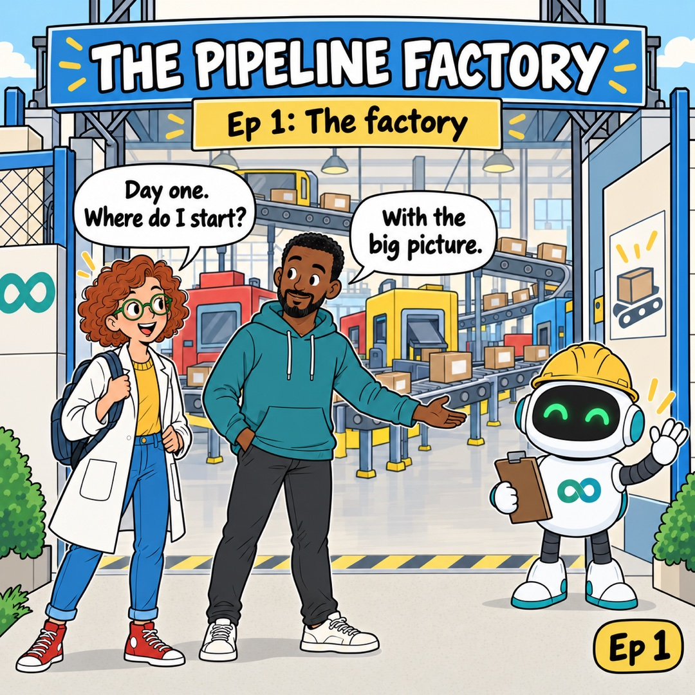
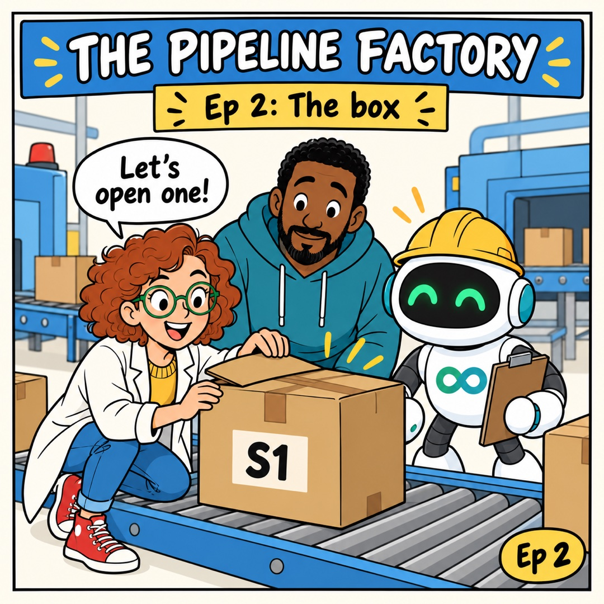
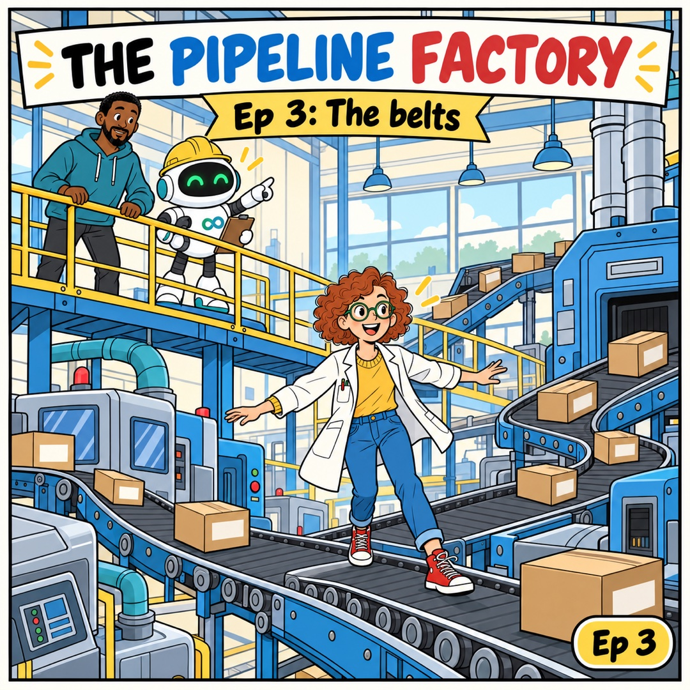
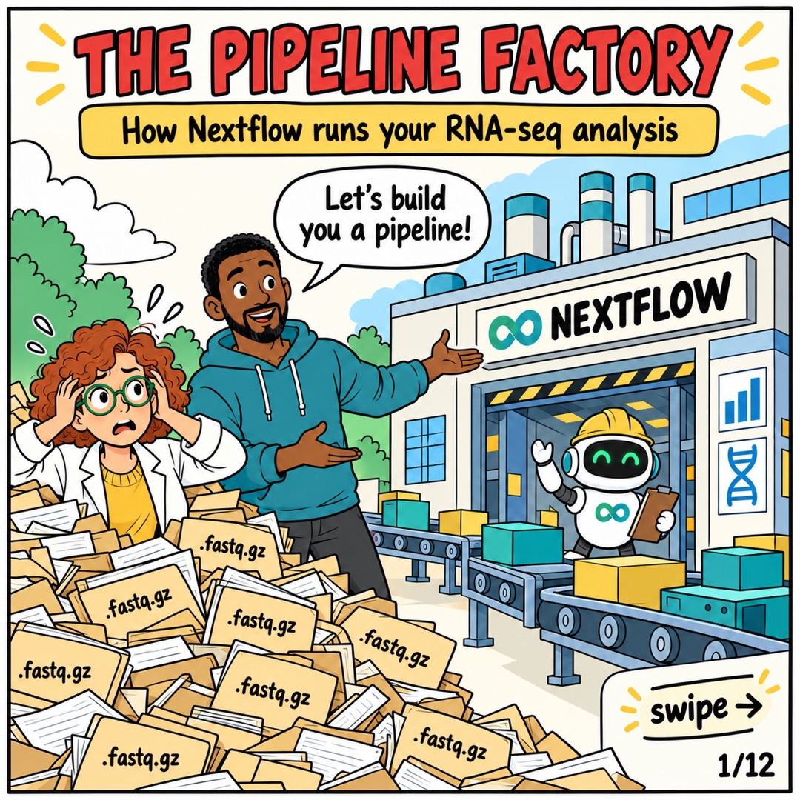
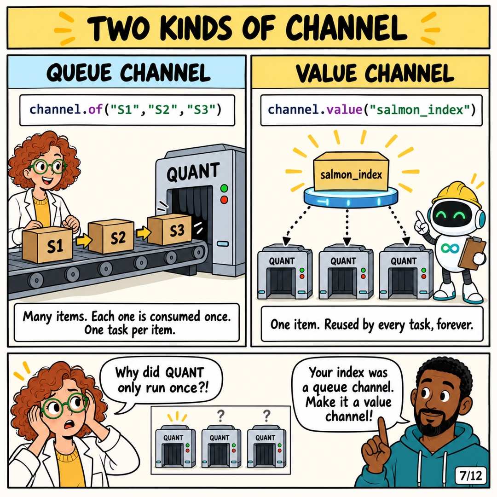

<div align="center">

# Learn with Ibex

**Bioinformatics explained in comics. No jargon, no prior knowledge needed.**



</div>

---

## The Pipeline Factory: Nextflow for everyone

Nextflow runs data-analysis pipelines. This series explains it as a **factory**: stations do the work,
conveyor belts carry boxes of samples between them, and a manager makes sure every sample goes through every step.

Swipe through an episode below, or download the PDF.

| | Episode | What you will learn | |
|:-:|---|---|:-:|
|  | **Ep 1 · The factory** | What Nextflow is, and what each file in the project folder does | [Slides](nextflow-pipeline-factory/episodes/ep1) · [PDF](nextflow-pipeline-factory/episodes/ep1.pdf) |
|  | **Ep 2 · The box** | What a sample looks like inside Nextflow: `val`, `path` and `tuple` | [Slides](nextflow-pipeline-factory/episodes/ep2) · [PDF](nextflow-pipeline-factory/episodes/ep2.pdf) |
|  | **Ep 3 · The belts** | How data moves: normal belts, shelves and `.collect()` | [Slides](nextflow-pipeline-factory/episodes/ep3) · [PDF](nextflow-pipeline-factory/episodes/ep3.pdf) |

*More episodes coming: the control room (`nextflow.config`), the toolbox (`bin/`), and run & resume.*

### The factory at a glance

| In the factory | In Nextflow |
|---|---|
| Blueprint | `main.nf`: which steps run, in what order |
| Control room | `nextflow.config`: laptop or cluster, how much memory |
| Toolbox | `bin/`: your own Bash and R scripts |
| Raw materials | `data/`: your read files |
| Station | a **process**: one step that does one job |
| Conveyor belt | a **channel**: carries data between steps |
| Labelled box | one **sample**: its name plus its two read files |
| Shelf | a **value channel**: shared by every step, never used up |

---

## The full comic

Prefer one long story? The original 12-page comic covers the same ideas in one go.

<p align="center">
  
  
  
</p>

[All pages](nextflow-pipeline-factory/comic) · [Download PDF](nextflow-pipeline-factory/comic/the-pipeline-factory.pdf)

---

## The real pipeline

Everything in the comics is real code. [`nextflow-pipeline-factory/pipeline/`](nextflow-pipeline-factory/pipeline) is a small RNA-seq pipeline:

```
FASTQC        checks read quality
SALMON_INDEX  builds a gene map
QUANT         counts reads per gene        (bin/run_salmon.sh)
DESEQ2        compares the groups          (bin/deseq2.R)
```

Put your files in `data/` (`S1_R1.fastq.gz`, `S1_R2.fastq.gz`, …, `transcripts.fa.gz`, `samples.csv`), then:

```bash
cd nextflow-pipeline-factory/pipeline
nextflow run main.nf -profile docker      # or: standard (conda), slurm (cluster)
nextflow run main.nf -profile docker -resume   # after a crash: only unfinished steps run again
```

---

<div align="center">

**Follow on GitHub for more: [github.com/loukesio](https://github.com/loukesio)**

</div>
